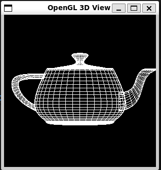
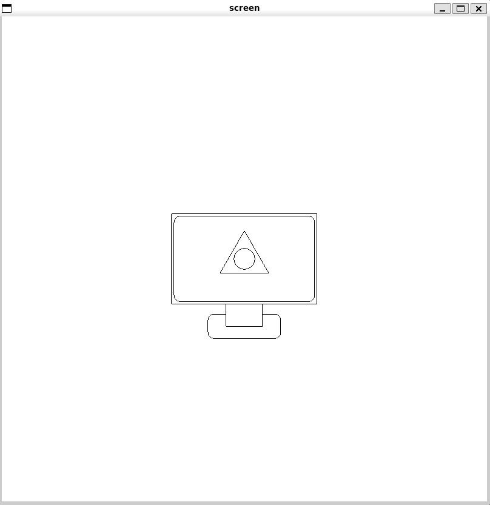
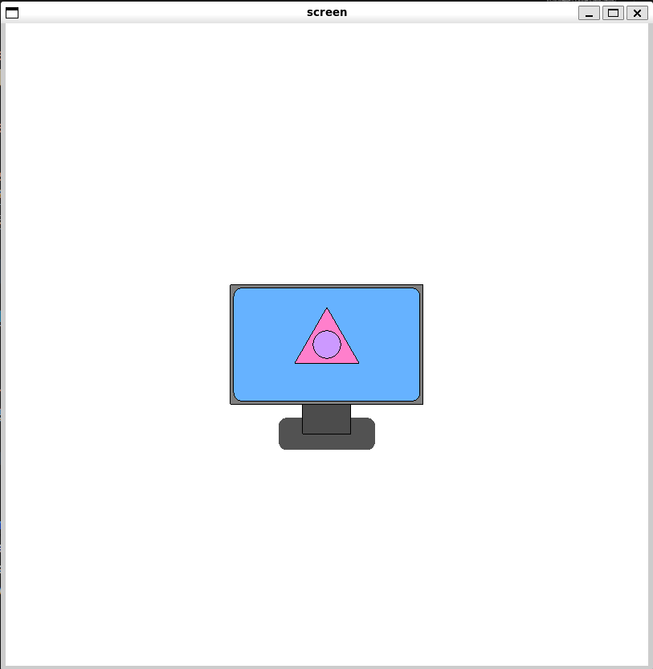
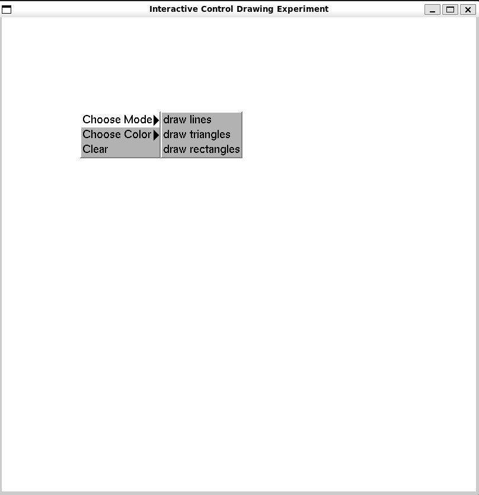

# 1. 代码明细
目录结构如下，每个文件夹下存放一个实验的源码和编译产生的可执行文件。
```c
.
├── teapot              // 实验1：测试程序
│   ├── main
│   └── main.cpp
├── basic_graphics      // 实验2：基本图形绘制
│   ├── main
│   └── main.cpp
├── color_filling       // 实验3：平面多边形区域填充
│   ├── main
│   └── main.cpp
├── interactive_window  // 实验4：交互控制绘制
│   ├── main
│   └── main.cpp
├── fig                 // 图片文件夹
│   └── ...
├── makefile            // Cmake编译脚本
└── Readme.md           // 说明文档
```


# 2. 环境配置
使用 WSL2 的 Ubuntu22.04 完成环境配置，无实验文档外的其他依赖包。

# 3. 程序编译及运行命令
## 3.1 编译所有文件
`make all` 会编译所有实验文件夹下的所有 main.cpp 文件，将可执行文件 main 保存至各实验文件夹下。
## 3.2 编译并运行指定实验项目
`make <文件夹名>` 会编译指定实验文件夹下的 main.cpp 文件，并自动运行该文件夹下的可执行文件 main 。

# 4. 实验效果
## 4.1 测试程序
### 实现效果


## 4.2 基本图形绘制
### 实现效果


### 整体绘制思路：
1. 绘制显示器：原点处作画，外围为空心矩形边框，内部屏幕为空心圆角矩形。
2. 绘制显示器图案：原点处作画，一个空心等边三角形，其内包含一个空心小圆。
3. 绘制底座：原点下方距离(显示器高度/2 + 支架高度)处作画，一个空心圆角矩形。
4. 绘制支架：原点下方距离(显示器高度/2 + 支架高度/2)处作画，先画一个白色实心矩形覆盖底座不可见区域，再画一个空心矩形。

### 绘图工具封装
画空心矩形函数 `draw_hollow_rec()` 和画等边三角形函数 `draw_equilateral_triangle()` 直接由GL_LINE_LOOP基本图元绘制实现。

画实心矩形函数 `draw_filled_rec()` 直接由GL_QUADS基本图元绘制实现。

画四分之一圆弧函数 `draw_quater_circle()` 利用GL_LINE_STRIP图元，绘制折线来拟合圆弧效果。具体实现为：从一个起始坐标方位角 θ（取决于圆弧方向）出发，每次递增一个小角度 θ = θ + Δθ ，使用cos和sin函数将该极坐标(r, θ)转换为笛卡尔坐标(x, y)来确定折线中间点，绘制折线，直到 θ 转过 90 度。
```c++
void draw_quater_circle(const float r, const int direction){
    const int num_segments = 16; // 用于近似圆弧的线段数
    // 逆时针画四分之一圆弧
    // 计算起始角度 (0=右上, 1=左上, 2=左下, 3=右下)
    float start_angle = direction * (PI / 2.0);

    glBegin(GL_LINE_STRIP);
        for (int i = 0; i <= num_segments; i++) {
            // 计算当前角度（从起始角度开始，递增 PI/2）
            float current_angle = start_angle + (PI / 2.0 * i / num_segments);
            
            // 将极坐标转换为笛卡尔坐标
            float x = r * cos(current_angle);
            float y = r * sin(current_angle);
            
            glVertex2f(x, y);
        }
    glEnd();    

}
```

画空心圆函数 `draw_hollow_circle()` 则直接调用四遍 `draw_quater_circle()` 函数画出四个方向的圆弧，即为一个空心圆。

画空心圆角矩形函数 `draw_hollow_rounded_rec()` 的实现，使用了GL_LINES图元绘制上下左右四条直线，然后借助 `glTranslatef()` 平移变换及画四分之一圆弧函数 `draw_quater_circle()` 画出四个圆角。
```c++
void draw_rounded_rec(const float w, const float h, const float r){
    const float half_w_line = w / 2.0 - r;
    const float half_h_line = h / 2.0 - r;
    glBegin(GL_LINES);
        // 上
        glVertex2f(half_w_line, h/2.0);
        glVertex2f(-half_w_line, h/2.0);
        // 下
        glVertex2f(half_w_line, -h/2.0);
        glVertex2f(-half_w_line, -h/2.0);     
        // 左
        glVertex2f(-w/2.0, half_h_line);
        glVertex2f(-w/2.0, -half_h_line);
        // 右
        glVertex2f(w/2.0, half_h_line);
        glVertex2f(w/2.0, -half_h_line);
    glEnd();    

    // 绘制圆角
    glPushMatrix();
        glTranslatef(half_w_line, half_h_line, 0.0f);
        draw_quater_circle(r, RIGHT_UP);
    glPopMatrix();
    glPushMatrix();
        glTranslatef(-half_w_line, half_h_line, 0.0f);
        draw_quater_circle(r, LEFT_UP);
    glPopMatrix();
    glPushMatrix();
        glTranslatef(-half_w_line, -half_h_line, 0.0f);
        draw_quater_circle(r, RIGHT_DOWN);
    glPopMatrix();
    glPushMatrix();
        glTranslatef(half_w_line, -half_h_line, 0.0f);
        draw_quater_circle(r, LEFT_DOWN);
    glPopMatrix();
}
```

## 4.3 平面多边形区域填充
### 实现效果


### 整体绘制思路：
在实验 2 的基础上实现，只需要在每次画空心图案前先画一个有颜色填充的图案即可，需要注意绘图顺序需要遵循 Z-Order，即显示在上层的图案需要在后面绘制：
1. 显示器底色--显示器边框
2. 显示屏底色--显示屏边框
3. 三角形底色--三角形边框
4. 圆形底色--圆形边框
5. 底座底色--底座边框
6. 支架底色--支架边框

### 绘图工具封装
绘制空心图案的函数沿用实验 2 封装好的函数，需要添加的是每次绘图前的颜色设置逻辑和实心图案绘制函数的封装。

画实心等边三角形函数 `draw_filled_triangle()` 直接由GL_TRIANGLES图元实现。

画实心矩形函数 `draw_filled_rec()` 直接由GL_QUADS基本图元绘制实现。

画实心圆函数 `draw_filled_circle()` 使用GL_TRIANGLE_FAN图元，通过三角扇形拟合圆形，实现逻辑与画空心圆一致，都是由极坐标系转笛卡尔坐标系实现。
```c++
void draw_filled_circle(const float r){
    const int num_segments = 64; // 用于近似圆弧的线段数
    const float delta_angle = 2 * PI / num_segments;
    float current_angle = 0.0;
    glBegin(GL_TRIANGLE_FAN);
        glVertex3f(0.0f, 0.0f, 0.0f); // 中心点
        for (int i = 0; i <= num_segments; i++)
        {
            // 将极坐标转换为笛卡尔坐标
            float x = r * cos(current_angle);
            float y = r * sin(current_angle);
            glVertex2f(x, y);
            current_angle += delta_angle;
        }
    glEnd();
}
```

画实心圆角矩形函数 `draw_filled_rounded_rec()` 先分别以上下、左右为一组对边，调用 `draw_filled_rec()` 各画一个实心矩形，然后在四个角的位置调用 `draw_filled_circle()` 画四个实心圆形，从而覆盖整个圆角矩形区域。
```c++
void draw_filled_rounded_rec(const float w, const float h, const float r){
    const float half_w_line = w / 2.0 - r;
    const float half_h_line = h / 2.0 - r;
    draw_filled_rec(w - 2 * r, h);
    draw_filled_rec(w, h - 2 * r);
    glPushMatrix();
        glTranslatef(half_w_line, half_h_line, 0.0f);
        draw_filled_circle(r);
    glPopMatrix();
    glPushMatrix();
        glTranslatef(-half_w_line, half_h_line, 0.0f);
        draw_filled_circle(r);
    glPopMatrix();
    glPushMatrix();
        glTranslatef(-half_w_line, -half_h_line, 0.0f);
        draw_filled_circle(r);
    glPopMatrix();
    glPushMatrix();
        glTranslatef(half_w_line, -half_h_line, 0.0f);
        draw_filled_circle(r);
    glPopMatrix();
}
```

## 4.4 交互控制绘制
### 实现效果



### 绘图管理
为了保存历史绘图记录，以保持绘制过的图案，需要一个全局的存储空间来记录绘制过的历史图案。因此定义结构体 Shape 来记录每个图形的绘图信息，定义 Shape 类型的数组 shapes 来存储已绘制的图形。
```c++
// 形状结构体
typedef struct {
    int mode;       // 形状
    float color[3]; // R, G, B
    float x1, y1;   // 起点
    float x2, y2;   // 终点
} Shape;
```

### 菜单实现
创建菜单的逻辑封装在 `init_menu()` 函数中，主菜单包括 选择绘图模式“Choose Mode”、选择绘图颜色“Choose Color”和清屏“Clear”三种选择，其中前两者各为一个子菜单，分别包含图形和颜色选择，通过全局变量 `currentMode` 和 `currentColor[3]` 数组来记录用户选择的绘图模式和颜色。后者则通过设置绘制过的图形数 `numShapes` 为0来清空历史图形。
```c++
void colorSelect(int choice) {
    switch (choice) {
        case COLOR_RED: currentColor[0] = 1.0f; currentColor[1] = 0.0f; currentColor[2] = 0.0f; break;
        case COLOR_GREEN: currentColor[0] = 0.0f; currentColor[1] = 1.0f; currentColor[2] = 0.0f; break;
        case COLOR_BLUE: currentColor[0] = 0.0f; currentColor[1] = 0.0f; currentColor[2] = 1.0f; break;
        case COLOR_YELLOW: currentColor[0] = 1.0f; currentColor[1] = 1.0f; currentColor[2] = 0.0f; break;
    }
}
void modeSelect(int choice) {
    currentMode = choice;
}
void mainSelect(int choice) {
    if (choice == 2) { // 'Clear' 选项的 ID 为 2
        numShapes = 0; // 清除所有存储的形状
        glutPostRedisplay();
    }
}
void init_menu() {
    // 创建颜色子菜单
    int color_menu = glutCreateMenu(colorSelect);
    glutAddMenuEntry("red", COLOR_RED);
    glutAddMenuEntry("green", COLOR_GREEN);
    glutAddMenuEntry("blue", COLOR_BLUE);
    glutAddMenuEntry("yellow", COLOR_YELLOW);
    // 创建模式子菜单
    int mode_menu = glutCreateMenu(modeSelect);
    glutAddMenuEntry("draw lines", DRAW_LINE);
    glutAddMenuEntry("draw triangles", DRAW_TRIANGLE);
    glutAddMenuEntry("draw rectangles", DRAW_RECTANGLE);
    // 创建主菜单，连接子菜单和 Clear 选项
    glutCreateMenu(mainSelect); 
    glutAddSubMenu("Choose Mode", mode_menu);
    glutAddSubMenu("Choose Color", color_menu);
    glutAddMenuEntry("Clear", 2); // '2' 是用于 mainSelect 的 ID
    // 绑定到鼠标右键
    glutAttachMenu(GLUT_RIGHT_BUTTON);
}
```


### 交互控制实现
注册鼠标和拖拽回调函数来分别对左键点击动作和拖拽动作进行响应，以实现绘图和拖拽过程中的实时动态显示。

鼠标回调函数 `mouseCallback()`：仅关注左键动作，若为点击，则记录点击位置为绘图起始位置；若为松开，则将松开位置记录为绘图结束位置，并将该图形存储到已绘制图形数组中。

拖拽回调函数 `motionCallback()` 则实时设置鼠标当前所在位置为绘图结束位置。

`display()`函数每次被调用时，先将历史绘制过的图形绘制一遍，然后根据全局记录的起始点和结束点位置，实时绘制当前正在拖拽的图形，从而实现动态实时反馈的效果。
```c++
void mouseCallback(int button, int state, int x, int y) {
    float gl_x = x * 2.0f / windowWidth - 1.0f;
    float gl_y = 1.0f - y * 2.0f / windowHeight;

    if (button == GLUT_LEFT_BUTTON) {
        if (state == GLUT_DOWN) {
            // 记录绘图起点
            startX = gl_x;
            startY = gl_y;
        } else if (state == GLUT_UP) {
            // 鼠标松开：将当前图形保存到数组中
            if (numShapes < MAX_SHAPES) {
                shapes[numShapes].mode = currentMode;
                shapes[numShapes].color[0] = currentColor[0];
                shapes[numShapes].color[1] = currentColor[1];
                shapes[numShapes].color[2] = currentColor[2];
                shapes[numShapes].x1 = startX;
                shapes[numShapes].y1 = startY;
                shapes[numShapes].x2 = gl_x;
                shapes[numShapes].y2 = gl_y;
                numShapes++;
            }
            // 清除终点，防止松开后仍然显示
            endX = startX; 
            endY = startY;
            glutPostRedisplay();
        }
    }
}
void motionCallback(int x, int y) {
    endX = x * 2.0f / windowWidth - 1.0f;
    endY = 1.0f - y * 2.0f / windowHeight;
    glutPostRedisplay(); // 强制窗口重绘，显示拖拽效果
}
void display(void) {
    glClear(GL_COLOR_BUFFER_BIT);
    // 绘制所有已存储的图形
    for (int i = 0; i < numShapes; i++) {
        drawShape(shapes[i]);
    }
    // 绘制当前正在拖拽的临时图形 (实时反馈)
    if (startX != endX || startY != endY) {
        drawShape((Shape){
            currentMode,
            {currentColor[0], currentColor[1], currentColor[2]},
            startX, startY, endX, endY
        });
    }

    glFlush();
}
```