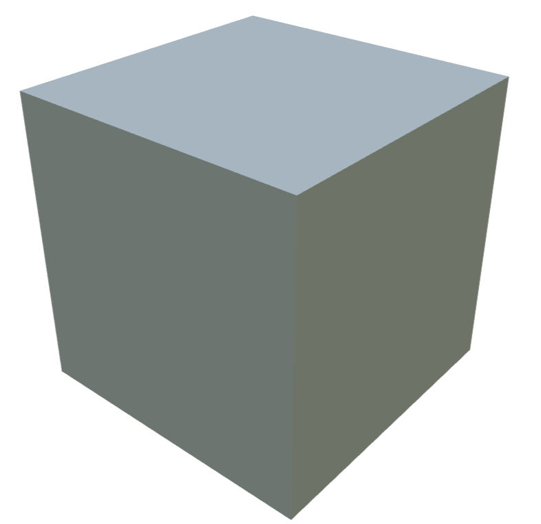
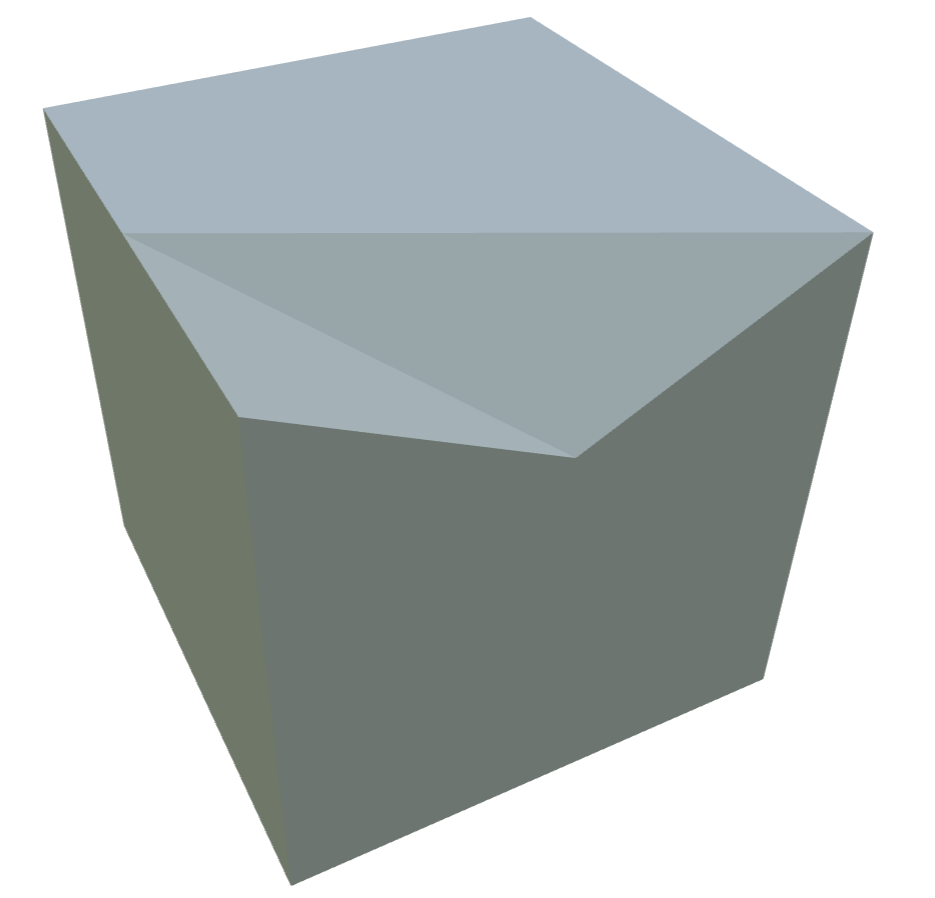
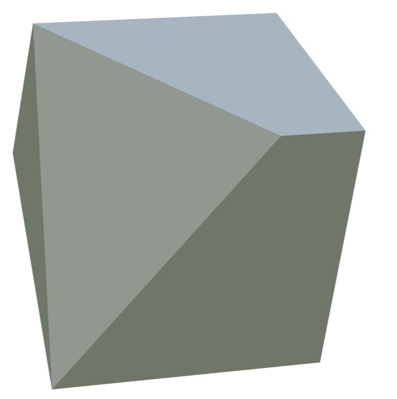
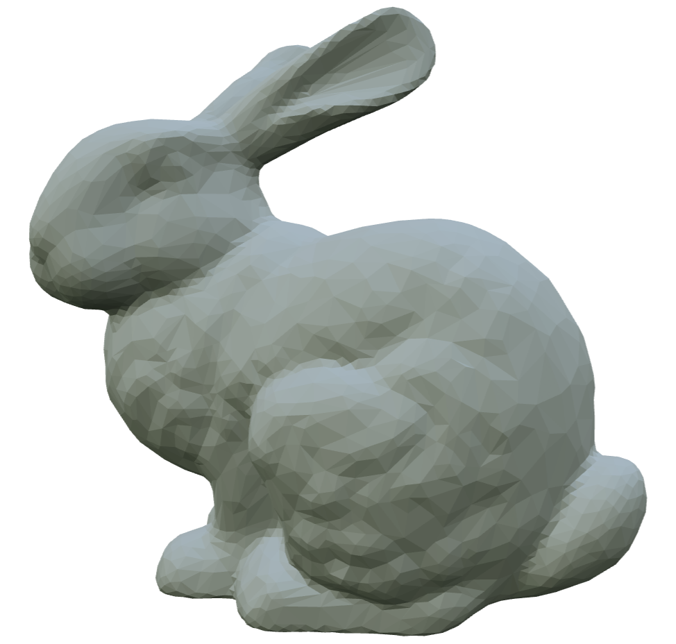
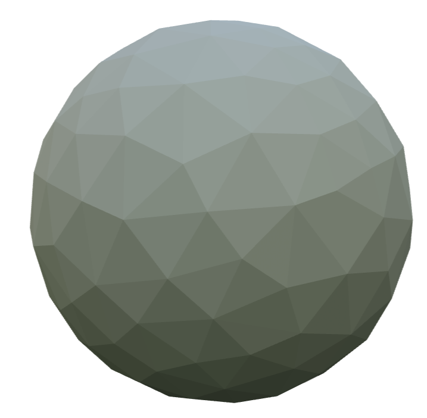
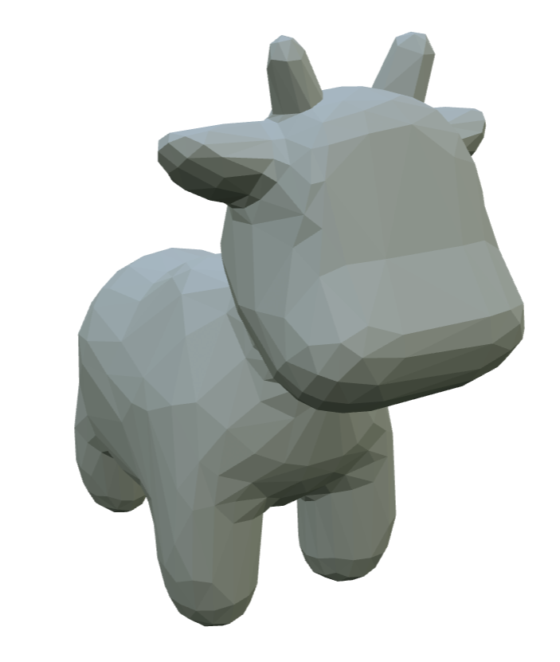
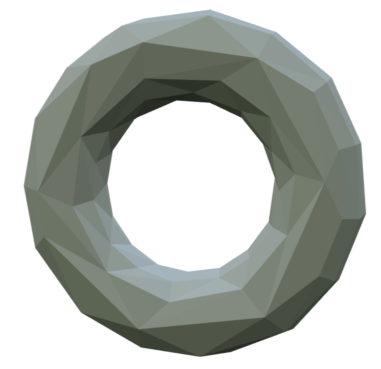

# Project-2: Mesh Simplification
## 1. 代码明细
目录结构如下，每个文件夹下存放一个实验的源码和编译产生的可执行文件。
```bash
.
├── assets                  # 原始网格模型 (.obj 格式)
├── build                   # CMake 构建产物
├── external/glm            # 数学库依赖
├── meshark
│   ├── apps                # 应用入口：simplify.cc (简化器主程序)
│   ├── include             # 头文件：定义半边表结构与简化逻辑
│   └── src                 # 源码实现：核心拓扑操作与 QEM 算法
├── output                  # 结果输出目录
│   ├── 0.25 | 0.5 | 0.75   # 按简化率分类的输出模型
│   ├── fig                 # 模型对比截图
│   └── readme.md           # 模型效果展示与说明书
├── build_and_run.sh        # 自动化编译并批量运行脚本
├── run.sh                  # 批量运行脚本
├── CMakeLists.txt          # 项目构建配置文件
├── README.md               # 项目说明书
└── README.pdf              # 项目说明书 PDF 版
```


## 2. 环境配置
由于支持实验环境（Ubuntu 20.04）的 gcc 最高版本仅有 gcc-11，且不支持 C++20 标准中的 <format> 库，本项目改为使用 <fmt/core.h> 库进行字符串格式化，并在 meshark/CMakeLists.txt 中添加了链接库选项 fmt。

```cmake
add_executable(simplify apps/simplify.cc)
target_link_libraries(simplify meshark fmt)
```

## 3. 程序编译及运行命令

一键编译并运行（请将<alpha>替换为您想使用的简化率，例如 0.5）： 该脚本会自动检查 build 目录，调用 CMake 和 Make 进行编译，随后处理 assets 下的所有模型。
```bash
sh ./build_and_run.sh <alpha>
```

仅运行程序（前提是已编译）：
```bash
sh ./run.sh <alpha>
```

上述脚本会自动将 `assets` 中的网格模型全部按照指定的简化率进行简化，简化后的模型放在 `output/<简化率>` 目录下。

## 4. 算法实现与实验结果

### 4.1 算法原理：二次误差度量 (QEM)

本项目基于 Garland 和 Heckbert 提出的 **Quadric Error Metric (QEM)** 算法实现网格简化。其核心思想是：

1. **误差量化**：每个顶点 $v$ 维护一个 $4\times4$ 的对称矩阵 $Q$，代表该点到其相邻平面集合的距离平方和。误差 $E(v) = v^T Q v$。
2. **边坍缩代价**：对于边 $(v_1, v_2)$，计算其坍缩后的新顶点 $\bar{v}$ 的最佳位置。新顶点的误差矩阵为 $Q_{new} = Q_1 + Q_2$。
3. **贪心策略**：将所有边按照坍缩产生的误差代价排序放入优先队列，每次取出代价最小的边进行坍缩，并更新周围受影响元素的误差矩阵和代价。

### 4.2 核心代码实现

#### 4.2.1 半边表迭代器实现

为了高效遍历顶点的邻域，在 `Project2/meshark/include/meshark/mesh-elements.h` 的 `VertexElement` 中实现了 `OutgoingHalfEdgeRange` 迭代器。

* **逻辑**：利用半边结构的 `twin` 和 `next` 指针，公式为 `h_next = h_current->twin->next`，从而实现围绕顶点的逆时针遍历。

```cpp
      Iterator &operator++() {
        // TODO: implement operator++ for OutgoingHalfEdgeRange::Iterator
        it = it->twin->next;
        if (it == start) it = static_cast<HalfEdge>(nullptr); // 如果回到了起点，置为空，表示结束
        return *this;
      }
```

#### 4.2.2 QEM 矩阵与代价计算

在 `src/mesh-simplifier.cc` 中实现了数学计算核心：

* **`computeQuadricMatrix`**：遍历顶点周围的面，获取法线 $n=[a,b,c]$ 和距离 $d = -n \cdot v$，构建平面向量 $p=[a,b,c,d]^T$，累加 $K_p = p \cdot p^T$ 得到 $Q$ 矩阵。
```cpp
glm::mat4 MeshSimplifier::computeQuadricMatrix(Vertex v) const {
  // TODO: implement this function
  // ax + by + cz + d = 0 
  // n = [a, b, c]^T
  // p = [a, b, c, d]^T
  // K_p = p * p^T
  // Q_v = \sum_{f \in faces(v)} K_{p,f}

  glm::mat4 Q(0.0f);
  for (HalfEdge h : v->outgoingHalfEdges())
  {
    Face f = h->face;
    
    if (!f) continue; // 防止边界情况
    glm::vec3 n = mesh.normal(f); // 平面法线
    // 利用 v 坐标求出 d
    glm::vec3 v_pos = mesh.pos(v);
    float d = -glm::dot(n, v_pos);

    glm::vec4 p(n.x, n.y, n.z, d);
    glm::mat4 Kp = glm::outerProduct(p, p);
    Q += Kp;
  }

  return Q;
}
```


* **`computeOptimalCollapsePosition`**：构建线性方程组 $A\bar{v} = [0,0,0,1]^T$ 求解最优位置。对于矩阵不可逆的退化情况，此时在端点和中点间选择代价最小者。

```cpp
glm::vec3 MeshSimplifier::computeOptimalCollapsePosition(Edge e) const {
  // TODO: implement this function
  Vertex v1 = e->firstVertex();
  Vertex v2 = e->secondVertex();

  glm::mat4 Q1 = Q(v1); 
  glm::mat4 Q2 = Q(v2);
  glm::mat4 Q_sum = Q1 + Q2;

  // 修改Q_sum最后一行 (Row 3)
  glm::mat4 A = Q_sum;
  A[0][3] = 0.0f; 
  A[1][3] = 0.0f;
  A[2][3] = 0.0f; 
  A[3][3] = 1.0f;

  // 目标向量 b = [0, 0, 0, 1]
  glm::vec4 b(0.0f, 0.0f, 0.0f, 1.0f);

  // 尝试求解方程组
  // 检查行列式是否接近 0，防止除以零或数值不稳定
  if (std::abs(glm::determinant(A)) > 1e-7) {
    // 矩阵可逆，直接求解: x = A^-1 * b
    glm::mat4 A_inv = glm::inverse(A);
    glm::vec4 v_opt = A_inv * b;
    return glm::vec3(v_opt); // 隐式转换为 vec3 (丢弃 w)
  }

  // 如果矩阵不可逆，在两个端点和中点之间选择代价最小的位置
  glm::vec3 p1 = mesh.pos(v1);
  glm::vec3 p2 = mesh.pos(v2);
  glm::vec3 p_mid = (p1 + p2) * 0.5f;

  // 定义一个临时的 lambda 来计算代价: v^T * Q * v
  auto calculate_cost = [&](const glm::vec3& p) -> double {
    glm::vec4 v(p, 1.0f);
    // glm::dot(v, Q * v) 等价于 v^T * Q * v
    return glm::dot(v, Q_sum * v);
  };

  double cost1 = calculate_cost(p1);
  double cost2 = calculate_cost(p2);
  double cost_mid = calculate_cost(p_mid);

  // 返回代价最小的位置
  if (cost_mid < cost1 && cost_mid < cost2) return p_mid;
  if (cost1 < cost2) return p1;
  return p2;
}
```


#### 4.2.3 拓扑操作：边坍缩

实现了 `collapseEdge` 函数。这是实验中最复杂的部分，为了保证网格的流形性质和程序的健壮性，重点处理了以下细节：

1. **指针修复与野指针防御**：
在删除顶点 $v_{remove}$ 之前，不仅将其所有邻居的 `tail` 指针重定向到 $v_{keep}$，还特别修复了 `v_left` 和 `v_right` 的 `halfEdge` 指针。
```cpp
  // 1. 修改 v_remove 所有出边的 tail 为 v_keep，以及它们对边的 tip 为 v_keep
  for (HalfEdge h : v_remove->outgoingHalfEdges())
  {
    h->tail = v_keep;
    h->twin->tip = v_keep;
  }
  // 2. 保证 v_keep v_left v_right 指向的半边不是将被删除的半边
  v_keep->halfEdge() = h_right_prev->twin; // 必须是从 v_keep 发出的半边！！
  v_left->halfEdge() = h_left_next->twin;
  v_right->halfEdge() = h_right_next->twin;
```

2. **拓扑缝合**：
当边坍缩时，左右两个三角形退化，需要将保留边的外侧半边（`h_left_next->twin`）与删除边的外侧半边（`h_left_prev->twin`）互连。正确更新了 `twin` 指针以及 Edge 对象的 `halfEdge` 指向，防止悬空指针。
```cpp
  // 3. 缝合左右面的另外两条边
  // 修改半边的 twin
  h_left_next->twin->twin = h_left_prev->twin;
  h_left_prev->twin->twin = h_left_next->twin;
  h_right_next->twin->twin = h_right_prev->twin;
  h_right_prev->twin->twin = h_right_next->twin;
  // 修改左右面半边 twin 的 edge 成员为保留边
  h_left_next->twin->edge = h_left_prev->twin->edge = e_keep_left;
  h_right_next->twin->edge = h_right_prev->twin->edge = e_keep_right;

  // 修改半边所属 Edge 的 halfEdge 引用，保证其不指向即将被删除的半边
  e_keep_left->halfEdge() = h_left_next->twin;
  e_keep_right->halfEdge() = h_right_prev->twin;
```

3. **数据与拓扑同步删除**：
框架代码中 `edge_collapse_cost.removeEdgeData()` 操作会改变 cost 数组的大小并移动数据，它访问 cost 数组时使用的是 mesh 维护的索引，但它不负责更新索引。索引的更新工作由 `mesh.removeEdge()` 来完成。  
因此，为了避免两次连续的 `edge_collapse_cost.removeEdgeData()` 操作中，后一次操作使用错误的索引访问 cost 数组（一般情况下会导致逻辑错误，极端情况会导致Segment Fault），必须严格遵守每完成一次 `edge_collapse_cost.removeEdgeData()` 就需要一次 `mesh.removeEdge()` 的删除顺序。  
这一顺序确保了在删除后续边时，索引始终是有效且对应的，解决了在处理 `torus.obj` 等复杂模型时出现的崩溃问题。
```cpp
// 必须一条一条边删除，且严格保证 Data 和 Mesh 的操作是原子的
eraseEdgeMapping(e);                   // 1. 从优先队列 Map 中移除
edge_collapse_cost.removeEdgeData(e);  // 2. 从 Data 数组移除 (发生数据交换)
mesh.removeEdge(e);                    // 3. 从 Mesh 数组移除 (发生元素交换，更新索引)

```

#### 4.2.4 **级联更新**：
实现了 `updateVertexPos`，利用 `std::set` 和自定义比较器（基于裸指针比较）收集受影响的边，触发 `computeEdgeCost` 的重新计算和优先队列的更新。
```cpp
void MeshSimplifier::updateVertexPos(Vertex v, const glm::vec3 &pos) {
  // TODO: implement this function
  // 设置点坐标
  mesh.setVertexPos(v, pos);

  // 记录需要更新的点
  std::vector<Vertex> vertices_to_update;
  vertices_to_update.push_back(v);
  for (HalfEdge h : v->outgoingHalfEdges()) {
      vertices_to_update.push_back(h->tip);
  }

  // 更新这些顶点的Q矩阵，并记录需要更新的边
  // 定义一个 Lambda 比较器用于 set
  auto edgeComparator = [](Edge a, Edge b) {
      return a.get() < b.get(); // 比较原始指针地址
  };
  // 使用自定义比较器的 set 来收集受影响的边
  std::set<Edge, decltype(edgeComparator)> edges_to_update(edgeComparator);

  for (Vertex u : vertices_to_update) {
      Q(u) = computeQuadricMatrix(u);
      // 收集该顶点连接的所有边
      for (HalfEdge h : u->outgoingHalfEdges()) {
          edges_to_update.insert(h->edge);
      }
  }

  // 更新这些边的代价（移出和重新插入优先队列由updateEdgeCost处理）
  for (Edge e : edges_to_update) {
      Real new_cost = computeEdgeCost(e);
      updateEdgeCost(e, new_cost); 
  }
}
```


### 4.3 结果展示

程序成功在不同简化率（0.25, 0.5, 0.75）下对所有测试模型完成了简化。所有简化后的 OBJ 文件均已保存在 `output/` 目录下，可直接使用 MeshLab 或 Open3D 或 通过 VScode 的 mesh-viewer 插件查看。

### 简化效果概览

* **Armadillo**: 在简化率 0.25 下，轮廓特征保持良好，手指等细微结构在低多边形下有所退化但依然清晰可辨。  


* **Cube_triangle**: 在简化率 0.75 下，正确地将三角形合并，保留了立方体的平面和尖锐边角特征（得益于 QEM 对平面误差的敏感性）。但是在简化率 0.5 下，出现了平面内陷的情况。简化率 0.25 时这种情况就更加严重。  




* **complex_bunny**: 图为简化率 0.25。轮廓特征保持良好，眼部细节纹理有所退化。  


* **Sphere**: 均匀简化，保持了球体的凸性。图为简化率 0.25。  


* **Spot**: 图为简化率 0.25。轮廓特征保持良好，脸部纹理完全被磨平。  


* **Torus**: 成功处理了非亏格为零的复杂拓扑，简化后圆环的孔洞特征保持完好，简化效果均匀。 



### 简化效果详细分析（以Armadillo为例）
**简化前模型效果**

顶点数：49990   面数：99976

简化前的模型纹理非常细腻，表面平滑，需要仔细观察才能辨别出一些三角面片。


**简化率 75% 效果**

顶点数：37493   面数：74982

简化 75% 的模型纹理依旧细腻，视觉效果与原模型基本一致，但胸口处已经可以较明显地观察出一些三角面片。


**简化率 50% 效果**

顶点数：24996   面数：49988

简化 50% 的模型已经开始丢失一些纹理细节（如耳廓明显变得不平滑），在身体各处都可以轻松地观察出三角面片，但简化效果仍然很好，保留了大部分原模型的特征，粗看并不影响视觉效果。


**简化率 25% 效果**

顶点数：12499   面数：24994

简化 25% 的模型已经大量丢失纹理细节，身体各处都呈现明显的 Low-poly 风格，但总的来说简化效果还是比较成功，保留了原模型的基本特征。

