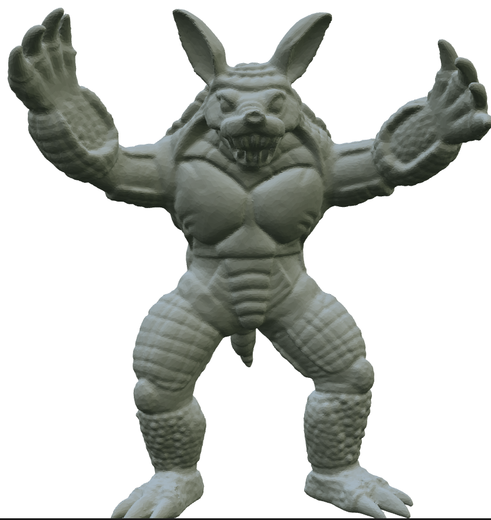
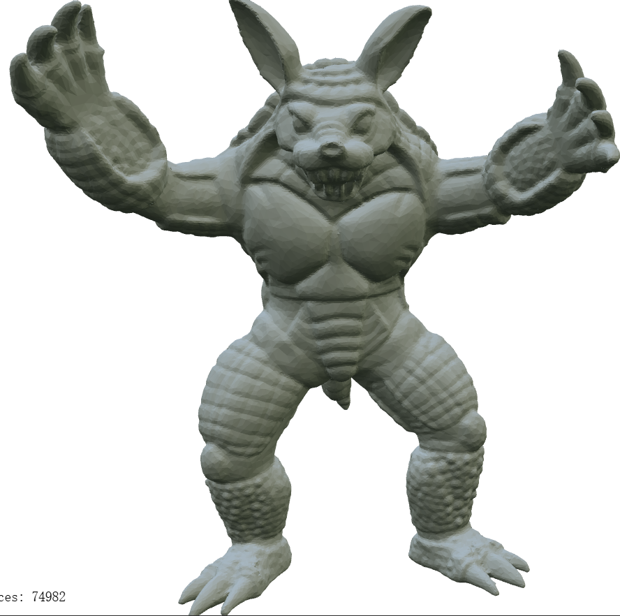
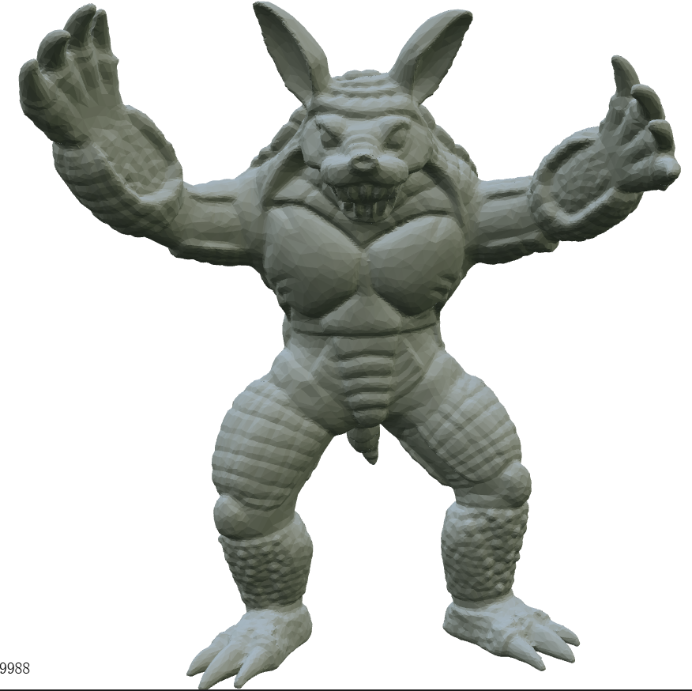
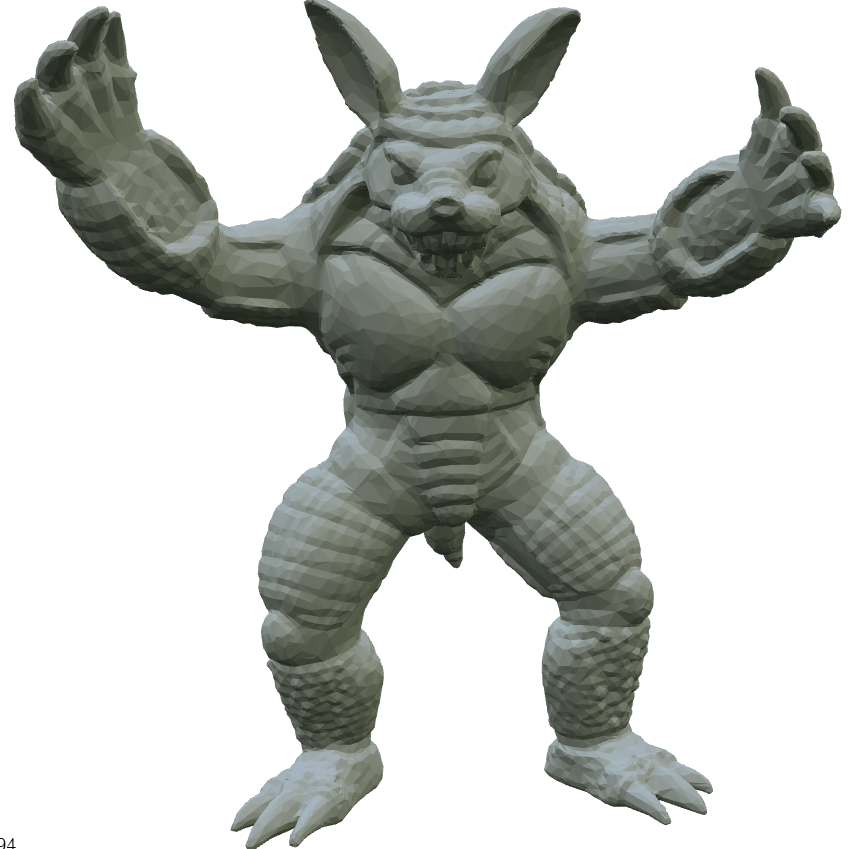

# 简化模型展示及说明

### 简化前模型效果
顶点数：49990   面数：99976

简化前的模型纹理非常细腻，需要仔细观察才能辨别出一些三角面片。

### 简化率 75% 效果
顶点数：37493   面数：74982

简化 75% 的模型纹理依旧细腻，视觉效果与原模型基本一致，但胸口处已经可以较明显地观察出一些三角面片。

### 简化率 50% 效果
顶点数：24996   面数：49988

简化 50% 的模型已经开始丢失一些纹理细节（如耳廓明显变得不平滑），在身体各处都可以轻松地观察出三角面片，但简化效果仍然很好，保留了大部分原模型的特征，粗看并不影响视觉效果。

### 简化率 25% 效果
顶点数：12499   面数：24994

简化 25% 的模型已经大量丢失纹理细节，身体各处都有明显的颗粒感，但总的来说简化效果还是比较成功，保留了原模型的基本特征。

