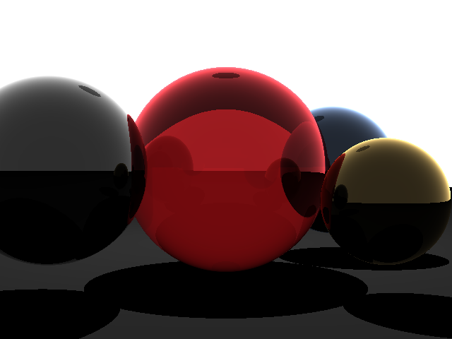
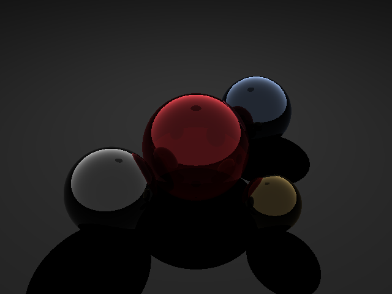
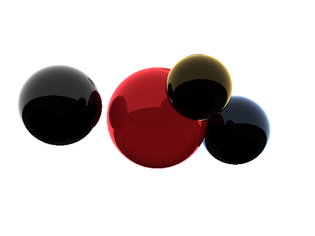
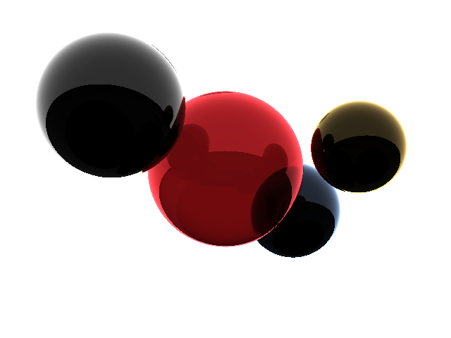

# 1. 代码明细
目录结构如下：
```bash
.
├── build                   # CMake 构建产物
├── include                 # 接口定义
│   ├── element.h           # 向量与球体类定义
│   ├── kd_tree.h           # kd树及相关函数
│   ├── stb_image_write.h   # 转png开源工具
│   └── trace.h             # 光线跟踪相关函数声明
├── makefile                # cmake编译脚本
├── output                  # 输出的渲染图
│   ├── frame_0.png
│   ├── frame_1.png
│   ├── frame_2.png
│   └── frame_3.png
├── README.md               # 项目说明书
├── README.pdf              # 项目说明书 PDF 版
└── src                     # 源码实现
    ├── main.cpp            # 主逻辑
    └── trace.cpp           # 光线跟踪函数、渲染函数实现
```


# 2. 环境配置
本实验基于 Linux (WSL2 Ubuntu 20.04) 交叉编译环境开发：

- 图形库: 依赖 FreeGLUT 和 OpenGL 实现实时交互界面。
- 编译器: g++ (支持 C++11 及以上标准)。
- 图像编码: 集成 stb_image_write 库，支持 R8G8B8 格式的 PNG 输出。

# 3. 程序编译及运行命令

全量编译：调用编译器进行增量构建，生成优化后的二进制执行文件至 `build/main`
```bash 
make all
``` 

执行程序：启动交互式渲染器
```bash 
make run
``` 

交互方式：程序会打印提示交互方式：“控制方式: W/S 前后, A/D 左右, R/F 上下, Z/X 缩放, C 保存渲染图”，点击 C 后渲染图会按序命名并保存到 `output/` 目录下。

# 4. 实验结果

## 4.1 KD-Tree 加速实现
为了处理复杂场景中的求交压力，本项目实现了实现了基于 轴对齐包围盒 (AABB) 的 KD 树加速算法：
- AABB 相交判定: 利用 Slab Method 将射线与三组平行平面的求交运算简化为一维区间重叠判断，显著减少了无效的球体相交运算。
```cpp
    // Slab法相交检测
    bool intersect(const Vec3f& rayorig, const Vec3f& raydir, float& t_enter, float& t_exit) const {
        float tmin = -INFINITY, tmax = INFINITY;

        // 分别检查 X, Y, Z 三个slab
        for (int i = 0; i < 3; ++i) {
            // 获取当前轴的分量 (0=x, 1=y, 2=z)
            float origin_val = (i == 0) ? rayorig.x : (i == 1 ? rayorig.y : rayorig.z);
            float dir_val    = (i == 0) ? raydir.x : (i == 1 ? raydir.y : raydir.z);
            float min_val    = (i == 0) ? min.x : (i == 1 ? min.y : min.z);
            float max_val    = (i == 0) ? max.x : (i == 1 ? max.y : max.z);

            if (std::abs(dir_val) < 1e-8) {
                // 光线在该轴平行，如果起点不在范围内，则必不相交
                if (origin_val < min_val || origin_val > max_val) return false;
            } else {
                float t1 = (min_val - origin_val) / dir_val;
                float t2 = (max_val - origin_val) / dir_val;
                if (t1 > t2) std::swap(t1, t2);
                
                tmin = std::max(tmin, t1);
                tmax = std::min(tmax, t2);
                
                if (tmin > tmax) return false; // 不相交
            }
        }
        
        t_enter = tmin;
        t_exit = tmax;
        return tmax > 0; // 如果 tmax < 0，盒子在光线背后
    }
```
- 启发式空间划分: 轮流选择 X, Y, Z 轴，以平分物体数为标准进行空间切分，将原始 $O(n)$ 的线性遍历复杂度降低至近似 $O(\log n)$。

- 遍历优化: intersect_kd_tree 采用深度优先搜索，并在递归过程中动态更新 tnear 距离，从而实现有效的剪枝。
```cpp
static KDNode* build_kd_tree(std::vector<const Sphere*>& objs, int depth) {
    KDNode* node = new KDNode();
    // 计算当前节点所有物体的整体包围盒
    for (const auto* s : objs) {
        node->bbox.expand(get_Sphere_AABB(*s));
    }

    // 终止条件：如果物体很少，或超过最大深度，直接作为叶子节点
    if (objs.size() <= 2 || depth > MAX_KD_TREE_DEPTH) {
        node->isLeaf = true;
        node->objects = objs;
        return node;
    }

    // 选择分割轴 (按深度循环选择 X, Y, Z)
    int axis = depth % 3;

    // 按球体中心在所选轴上的位置排序
    std::sort(objs.begin(), objs.end(), [axis](const Sphere* a, const Sphere* b) {
        if (axis == 0) return a->center.x < b->center.x;
        if (axis == 1) return a->center.y < b->center.y;
        return a->center.z < b->center.z;
    });

    // 取中位数进行切分
    size_t mid = objs.size() / 2;
    std::vector<const Sphere*> left_objs(objs.begin(), objs.begin() + mid);
    std::vector<const Sphere*> right_objs(objs.begin() + mid, objs.end());

    // 递归创建子节点
    node->left = build_kd_tree(left_objs, depth + 1);
    node->right = build_kd_tree(right_objs, depth + 1);

    return node;
}


static const Sphere* intersect_kd_tree(KDNode* node, const Vec3f& rayorig, const Vec3f& raydir, float& tnear) {
    if (!node) return nullptr;

    float t_enter, t_exit;
    // 如果光线没射中当前节点的 AABB，或者 AABB 在当前已找到的最短距离之外，直接跳过
    if (!node->bbox.intersect(rayorig, raydir, t_enter, t_exit) || t_enter > tnear) {
        return nullptr;
    }

    // 如果是叶子节点，遍历其中的球体
    if (node->isLeaf) {
        const Sphere* hitObj = nullptr;
        for (const auto* s : node->objects) {
            float t0 = INFINITY, t1 = INFINITY;
            if (s->intersect(rayorig, raydir, t0, t1)) {
                if (t0 < 0) t0 = t1;
                if (t0 < tnear) {
                    tnear = t0;
                    hitObj = s;
                }
            }
        }
        return hitObj;
    }

    // 如果是内部节点，递归遍历子节点
    const Sphere* hitLeft = intersect_kd_tree(node->left, rayorig, raydir, tnear);
    const Sphere* hitRight = intersect_kd_tree(node->right, rayorig, raydir, tnear);

    if (hitRight) return hitRight; // 右子树最后更新了 tnear，说明找到了更近的物品，返回它
    return hitLeft;
}
```
## 4.2 交互式相机控制实现
使用 OpenGL 自定义按键功能实现交互控制相机位姿，并实现实时渲染。
基于相机基向量 ($u, v, w$) 建立了完整的观察坐标系转换：
- 实时矩阵更新: 每次按键后根据 camPos 与 camTarget 重新计算相机坐标轴，保证了平滑的视角转换。

- 坐标映射: 针对 OpenGL 窗口坐标（左下角原点）与标准图像缓冲区（左上角原点）的差异，在渲染管线中实现了 y 轴的翻转映射，确保了交互一致性。

程序运行后，用户可以通过键盘实时控制相机参数，观察场景细节：
- 视角移动: W/S 前后移动，A/D 左右平移，R/F 垂直升降。
- 镜头变焦: Z/X 调整视角（FOV），模拟变焦效果。
- 图像捕获: 按下 C 键，程序将当前缓冲区内容保存为 frame_{save_num}.png，并自动递增编号。

```cpp
// 相机交互参数
Vec3f g_camPos(0, 0, 5);      // 相机位置
Vec3f g_camTarget(0, 0, -20); // 观察目标点
float g_fov = 30.0f;          // 视场角

// 将 Vec3f 缓冲区转换为 OpenGL 可用的像素字节流
void updateDisplayBuffer() {
    renderToBuffer(g_spheres, g_camPos, g_camTarget, g_fov, g_imageBuffer);
}

void display() {
    glClear(GL_COLOR_BUFFER_BIT);

    // 将渲染好的图像绘制到屏幕
    // g_imageBuffer 存储的是 0-255 的 unsigned char RGB 数据
    glDrawPixels(g_width, g_height, GL_RGB, GL_FLOAT, g_imageBuffer);

    glutSwapBuffers();
}

// 交互控制
void keyboard(unsigned char key, int x, int y) {
    float step = 0.5f;
    switch (key) {
        case 'w': g_camPos.z -= step; break; // 前进
        case 's': g_camPos.z += step; break; // 后退
        case 'a': g_camPos.x -= step; break; // 左移
        case 'd': g_camPos.x += step; break; // 右移
        case 'r': g_camPos.y += step; break; // 上移
        case 'f': g_camPos.y -= step; break; // 下移
        case 'z': g_fov = std::max(5.0f, g_fov - 1.0f); break; // 缩小 FOV
        case 'x': g_fov = std::min(120.0f, g_fov + 1.0f); break; // 扩大 FOV
        case 'c': save_frame(g_imageBuffer, g_width, g_height, outdir); break;
        case 27:
            exit(0);
            break; // ESC 键退出
        }
    // 触发重新渲染
    updateDisplayBuffer();
    glutPostRedisplay();
}
```


## 4.3 渲染效果
使用多视角拍摄的渲染图如下，可以看到生成的 PNG 图像成功模拟了点光源照射下的高光、漫反射以及物体间的遮挡阴影。

优势：系统在 KD-Tree 的加速下表现出极高的响应速度，支持复杂视角的实时切换。

局限性：由于没有实现反走样，仔细观察可以发现阴影边缘有较明显的锯齿状走样。

改进方向: 计划在未来版本引入自适应超采样方法来平滑边缘。






